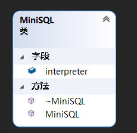

## API

### 功能概述

API 模块是整个系统的核心，其主要功能为提供执行 SQL 语句的接口，供 Interpreter 层调用。该接口以 Interpreter 层解释生成的命令内部表示为输入，根据 Catalog Manager 提供的信息确定执行规则，并调用 Record Manager 和 Catalog Manager 提供的相应接口进行执行，最后返回执行结果给 Interpreter 模块。

### 数据结构

API 内部比较重要的数据结构是三个数组，分别是用来存储 `create table` 语句中的各属性的名称及对应类型、`insert` 语句中各属性的值、 `delete` 和 `select` 语句中的各条件语句。

### 接口定义

```cpp
namespace API{

void createTable(const std::string &tableName, const std::vector<Column> &columns, const std::string &primaryKey);
void createIndex(const std::string &indexName, const std::string &tableName, const std::string &columnName);
void dropTable(const std::string &tableName);
void dropIndex(const std::string &indexName);
void insertOn(const std::string &tableName, std::vector<Value> &valueList);
void deleteFrom(const std::string &tableName, std::vector<Condition> &conditionList);
void deleteAll(const std::string &tableName);
void select(const std::string &tableName, std::vector<Condition> &conditionList);
void selectAll(const std::string &tableName);

void endLoop();

static CatalogManager *cm;
CatalogManager *getCatalogManager();
static RecordManager *rm;
RecordManager *getRecordManager();
    
} // namespace API
```

tableName、indexName、columnName 分别是 SQL 语句需要操作的表名、索引名和列名。

`std::vector<Column> &columns`  存储 `create table` 语句中的各属性的名称及对应类型。

`std::vector<Value> &valueList`  存储 `insert` 语句中各属性的值。

`std::vector<Condition> &conditionList` 存储  `delete` 和 `select` 语句中的各条件语句。

endLoop 函数用来结束 Interpreter 中 mainLoop 函数的循环。

getCatalogManager 和 getRecordManager 分别提供获得 CatalogManager 和 RecordManager 对象的指针的方法。

### 类图



### 设计思路

API 这一部分比较简单，实际上是在所有其它模块基本全部完成后才进行本模块的实现，获得的是 Interpreter 已经语法分析好并用特定数据结构存储的 SQL 语句，然后只需要合理调用 Catalog Manager 和 Record Manager 提供的接口即可。

### 关键函数

因为我们并没有进行对Index Manager 中 B+树结构的持久化工作，所以设计的 MiniSQL 类的构造函数会在每次程序运行开始时根据 Catalog Manager 中保存的模式信息重新创建索引：

```cpp
MiniSQL::MiniSQL()
{
    auto CM = API::getCatalogManager();
    auto RM = API::getRecordManager();

    for (auto const& index : CM->indices)
    {
        Table &table = CM->getTable(index.second.tableName);
        RM->im->CreateIndex(index.second.indexName, table, index.second.columnName);
    }
}
```

各种类型的 SQL 语句由以下函数完成，工作原理大同小异，同时调用 Catalog Manager 和 Record Manager 提供的接口，完成部分异常处理工作和后续的 SQL 语句操作：

```cpp
void createTable(const std::string &tableName, const std::vector<Column> &columns, const std::string &primaryKey);
void createIndex(const std::string &indexName, const std::string &tableName, const std::string &columnName);
void dropTable(const std::string &tableName);
void dropIndex(const std::string &indexName);
void insertOn(const std::string &tableName, std::vector<Value> &valueList);
void deleteFrom(const std::string &tableName, std::vector<Condition> &conditionList);
void deleteAll(const std::string &tableName);
void select(const std::string &tableName, std::vector<Condition> &conditionList);
void selectAll(const std::string &tableName);
```

这里仅详细展示 createTable 函数的细节，其余函数不再展开：

```cpp
void API::createIndex(const std::string &indexName, const std::string &tableName, const std::string &columnName)
{
    auto CM = API::getCatalogManager();
    auto RM = API::getRecordManager();
    
    if (CM->existIndex(indexName))
    {
        std::cout << "ERROR : You have an error in your SQL syntax; index named " << indexName << " already exists.\n";
        return ;
    }

    Table &table = CM->getTable(tableName);

    CM->newIndex(indexName, tableName, columnName);
    RM->im->CreateIndex(indexName, table, columnName);
}
```

endLoop 函数完成对 CatalogManager 和 RecordManager 对象的析构并结束程序：

```cpp
void API::endLoop()
{
    delete rm;
    delete cm;
    exit(0);
}
```

