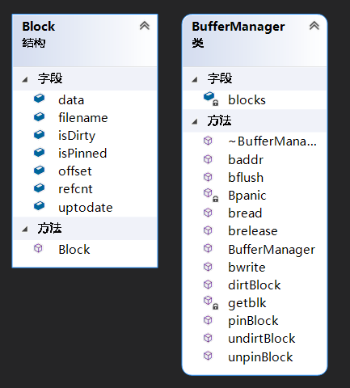

[TOC]

## BufferManager

### 功能描述

该部分是整个`MiniSQL`与文件的**接口**，其维护⼀个`In-Memory-Buffer`(size=0x1000)，缓存表⽂件中的相关记录，实现按块读取(size=4kb)。

`Buffer Manager`位于整个⼯程的最底层，直接与⽂件系统进⾏交互。对API、Record Manager提供创建⽂件、访问⽂件、访问相关记录、操作Block的相关接⼝。


### 数据结构

Buffer Manager维护一个`Block`的数组，其中Block的定义如下：

```c++
const int BLOCK_SIZE = 0x1000; // Block size

struct Block {
    char data[BLOCK_SIZE];  // Store data
    bool isPinned;          // Is pinned?
    bool isDirty;           // Is dirty?
    bool uptodate;          // uptodated?
    std::string filename;		// Store the file name
    int offset;             // Offset is similar to file pointer in files
    int refcnt;             // Number of reference
    
    Block();
};
```

- `data`是Block内部的缓冲区
- 每个Block通过`filename`和`offset`来标记其属于哪一个文件的哪一个块，便于后续的使用
- `isPinned`和`isDirty`确定块的Pin和Dirty状态：Pin块无法被释放，Dirty块在释放时会被**写回**
- `uptodate`标记缓冲的data是否是合法的
- `refcnt`记录块被引用的个数


Buffer Manager则对这样一个Block的数组进行维护，其数据结构如下：

```c++
typedef int BID;
const int BLOCK_NUM = 0x1000;

class BufferManager{
private:
    Block *blocks;
    BID getblk(std::string &, int);
    void Bpanic(const char *)const;
public:
    BufferManager();
    ~BufferManager();
    void pinBlock(BID bid);
    void dirtBlock(BID bid);
    void unpinBlock(BID bid);
    void undirtBlock(BID bid);
    BID  bread(std::string &, int);
    bool bwrite(BID bid);
    void brelease(BID bid);
    char*baddr(BID bid);
    void bflush(std::string &str);
};
```

- `blocks`就是Buffer Manager内部管理的Block数组
- `BID`是块描述符，参考文件描述符fd思路进行的设计
- 后面具体介绍提供外界使用的`b*`函数


### 接口定义

##### xBlock

包括4个函数: pinBlock, dirtyBlock, unpinBlock, undirtyBlock，其都接受一个参数：

- `BID bid` - 要操作块的BID

这四个函数的作用如命名所示，分别表示：pin一个块、unpin一个块、使一个块dirty、使一个块undirty

**Note** - 这四个函数在当前MiniSQL设计中并未用到。


##### bread

该函数会读取文件的内容并存储到内存里的`Block`中，其接受两个参数：

- `string &str` - 要读取的文件名称，后缀默认为`.data`，不需要自己加上
- `int off` - 文件内部的偏移量，以4096为一个单位

返回值是 `BID`

**Note** - 如果文件不存在，会自动创建该文件并打开，不过在使用时可以不考虑这一点，交给BufferManager就行。


##### bwrite

该函数将指定的`Block`写回到Disk上，其接受一个参数：

- `BID bid` - 即块描述符

返回值是 `bool`，成功则返回true，否则返回false


##### baddr

bread读取块内容到Block中后，需要通过baddr获取其内部的buffer地址，如此之后才可以往buffer内写入或读取，其接受一个参数：

- `BID bid` - 即指定的块描述符

返回值是`buffer`的地址


##### brelease

该函数释放一个Block，其接受一个参数：

- `BID bid` - 即块描述符

当一个Block不再使用时，应该使用brelease将其释放掉

**Note** - 如果块是pin的，那么将无法被释放；如果块是dirty的，那么在释放时将会写回到Disk上。


##### bflush

清空指定文件在Buffer内的缓存，其接受一个参数：

- `std::string filename` - 要清空Buffer的文件名

**Note** - 该函数主要是在一个文件被删除的时候被调用，以避免后续可能存在的错误使用，如非必要不应该使用，否则会有比较大的Overhead


### 类图



### 设计思路

`BufferManager`的设计参考`linux0.11`的 [buffer](https://elixir.bootlin.com/linux/0.11/source/fs/buffer.c) 设计。

采用自底向上的构建方式，首先是最基础的`Block`结构，记录该块的pin,dirty等信息，内部包含一个大小可调节的实际buffer区(data)。尽管有构造函数，但我还是认为将其视作一个简单的结构是更好的。

随后是对这样一些块进行管理的`Buffer Manager`，为了使外界使用简单


### 关键代码

首先是最关键的 `getblk` 函数，这是一个私有函数，用以查找一个可使用的Block:

```c++
BID BufferManager::getblk(std::string &str, int off){
    BID empty=-1;
    Block* bp = blocks;
    for(int i=0; i<BLOCK_NUM;i++, bp++){
        if(bp->filename == str && bp->offset == off){	// Cached block, so just return it
            bp->refcnt++;
            return i;
        }
        if(empty == -1 && bp->refcnt == 0)	// Or we record an empty one and return it
            empty = i;
    }
    if(empty == -1)
        Bpanic("No free blocks!");
    bp = blocks + empty;
    bp->filename = str;
    bp->offset = off;
    bp->refcnt = 1;
    bp->isDirty = bp->isPinned = bp->uptodate = false;
    memset(bp->data, 0, BLOCK_SIZE);
    return empty;
}
```

- 一方面根据输入的`str(filename)`和`off`来查找块是否已经被cache，如果在缓存里那么直接返回即可，否则记录一个空的Buffer，对其进行初始化后返回。


然后是bread函数，其实现对块内容的读取：

```c++
BID BufferManager::bread(std::string &str, int off){
    BID bid = getblk(str, off);
    Block * bp = blocks + bid;
    if(bp->uptodate) return bid;

    FILE *fp = fopen((str + ".data").c_str(), "rb+");

    if (fp == NULL) // If not exist, create one
        fp = fopen((str + ".data").c_str(), "wb+");

    fseek(fp, off * BLOCK_SIZE, 0);    // Realocate location
    int t = fread(bp->data, BLOCK_SIZE, 1, fp);
    if (t != 1)
    {
        if(ferror(fp)){
            printf("bread error, %s read fails!\n", str.c_str());
            return -1;
        }
        else if(feof(fp)) fwrite("\0", 1, 1, fp);
    }
    bp->uptodate = true;
    fclose(fp);
    return bid;
}
```

- 首先分配一个块，如果块的`uptodate`是true，表明其内容合法，无需再次读入，故直接返回
- 否则需要打开/新建该文件后，在将`off`指定的偏移量读入到Buffer里，随后再返回该块的BID


最后是bwrite函数，其将块写入到Disk上：

```c++
bool BufferManager::bwrite(BID bid){
    Block * bp = blocks + bid;
    FILE *fp = fopen((bp->filename + ".data").c_str(), "rb+");
    if (fp == nullptr)
        return false;

    fseek(fp, bp->offset * BLOCK_SIZE, 0);
    fwrite(bp->data, BLOCK_SIZE, 1, fp);
    fclose(fp);
    return true;
}
```

- 由于Block本身存储了其内容属于哪一个文件的哪一个块，故可以直接根据这些信息写入到Disk上

