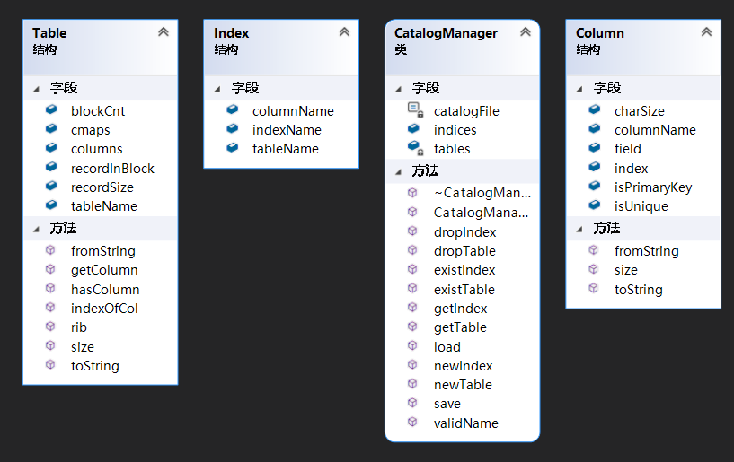

## Catalog Manager

### 功能概述

Catalog Manager负责管理数据库的所有模式信息，包括：

1. 数据库中所有表的定义信息，包括表的名称、表中字段（列）数、主键、定义在该表上的索引。

2. 表中每个字段的定义信息，包括字段类型、是否唯一等。

3. 数据库中所有索引的定义，包括所属表、索引建立在那个字段上等。Catalog Manager 还必需提供访问及操作上述信息的接口，供 Interpreter 和 API 模块使用。

### 数据结构

Catalog Manager 定义结构体 Table 来存储表的定义信息：

```cpp
struct Table 
{
    std::string tableName;
    std::vector<Column> columns;
    std::unordered_map<std::string, int> cmaps;
    int blockCnt;
    int recordSize;
    int recordInBlock;

    bool hasColumn(const std::string& columnName) const;
    Column getColumn(const std::string& columnName) const;
    int indexOfCol(const std::string& columnName);
    int size();
    int rib();
    std::string toString() const;
    static Table fromString(const char *&p);
};
```

Catalog Manager 定义结构体 Column 来存储列的定义信息：

```cpp
struct Column 
{
    std::string columnName;
    Field field;
    bool isPrimaryKey = false;
    bool isUnique = false;
    int charSize;
    std::string index = "";
    int size() const;
    std::string toString() const;
    static Column fromString(const char *&p);
};
```

Catalog Manager 定义结构体 Index 来存储索引的定义信息：

```cpp
struct Index 
{
    std::string indexName;
    std::string tableName;
    std::string columnName;
};
```

三个成员变量分别表示索引名、表名和属性名。

CatalogManager 类内部还有两个无序关联式 map 容器，分别用来维护表名与表的定义信息、索引名与索引的定义信息之间的映射关系。

### 接口定义

```cpp
CatalogManager();
~CatalogManager();

void newTable(const std::string &tableName, const std::vector<Column> &columns);
void newIndex(const std::string &indexName, const std::string &tableName, const std::string &columnName);
void dropTable(const std::string &tableName);
void dropIndex(const std::string &indexName);
bool existTable(const std::string &tableName) const;
bool existIndex(const std::string &indexName) const;
bool validName(const std::string &name) const;

Table &getTable(const std::string &tableName);
Index &getIndex(const std::string &indexName);
    
void load();
void save();
```

tableName、indexName、columnName 分别是 SQL 语句需要操作的表名、索引名和列名。

`std::vector<Column> &columns`  存储 `create table` 语句中的各属性的名称及对应类型。

existTable 函数和 existIndex 函数分别检测表是否存在、索引是否存在，便于进行初步的异常处理。

getTable 函数和 getIndex 函数分别是根据表名、索引名返回对应的表的定义信息、索引的定义信息。

### 类图



### 设计思路

Catalog Manager 实际上与 SQL 语句真正对数据库进行的操作不算很密切，但需要根据已经执行的 SQL 语句动态地修改在文件中需要存储的模式信息，这一操作在内存中完成会更加快速，因此仅在程序运行开始时统一读取文件和结束时统一写入文件。

Catalog Manager 类对外要提供创建表、检测表存在、获得表、创建索引、检测索引、删除表、写⽂件等接⼝，内部维护要实现正确读写⽂件的功能，并保存了表定义的元数据。

### 关键函数

Table::toString 函数和 Table::fromString 函数分别完成将表的定义信息序列化便于存储和从序列中提取出表的定义信息：

```cpp
std::string Table::toString() const
{
    std::string s;
    int nameSize = tableName.size();
    #ifdef DEBUG
    std::cout << "nameSize: " << nameSize << "\n";
    #endif // DEBUG
    std::copy_n(reinterpret_cast<char *>(&nameSize), sizeof(int), std::back_inserter(s));
    s += tableName;
    int columnsSize = columns.size();
    std::copy_n(reinterpret_cast<char *>(&columnsSize), sizeof(int), std::back_inserter(s));
    // std::copy_n(reinterpret_cast<const char*>(&recordCnt), sizeof(int), std::back_inserter(s));
    std::copy_n(reinterpret_cast<const char*>(&blockCnt), sizeof(int), std::back_inserter(s));

    for (const auto &column : columns)
    {
        s += column.toString();
    }

    #ifdef DEBUG
    std::cout << "tableString(in): " << s << "\n";
    #endif

    return s;
}

Table Table::fromString(const char *&p)
{
    Table table;
    int nameSize = *reinterpret_cast<const int *>(p);
    p += sizeof(int);
    std::copy_n(p, nameSize, std::back_inserter(table.tableName));
    p += nameSize;
    int columnsSize = *reinterpret_cast<const int *>(p);
    p += sizeof(int);
    // table.recordCnt = *reinterpret_cast<const int *>(p);
    // p += sizeof(int);
    table.blockCnt = *reinterpret_cast<const int *>(p);
    p += sizeof(int);

    for (int i = 0; i < columnsSize; i++)
    {
        Column column = Column::fromString(p);
        table.columns.emplace_back(column);
    }

    table.recordSize = 0;

    return table;
}
```

Column::toString 函数和 Column::fromString 函数分别完成将列的定义信息序列化便于存储和从序列中提取出列的定义信息：

```cpp
std::string Column::toString() const
{
    std::string s;
    int nameSize = columnName.size();
    std::copy_n(reinterpret_cast<char *>(&nameSize), sizeof(int), std::back_inserter(s));
    s += columnName;

    int tag = int(field);
    if (isUnique) tag |= 4;
    if (isPrimaryKey) tag |= 8;
    std::copy_n(reinterpret_cast<char *>(&tag), sizeof(int), std::back_inserter(s));
    std::copy_n(reinterpret_cast<const char *>(&charSize), sizeof(int), std::back_inserter(s));
    int indexSize = index.size();
    std::copy_n(reinterpret_cast<const char*>(&indexSize), sizeof(int), std::back_inserter(s));
    s += index;
    return s;
}

Column Column::fromString(const char *&p)
{
    Column column;
    int nameSize = *reinterpret_cast<const int *>(p);
    p += sizeof(int);
    std::copy_n(p, nameSize, std::back_inserter(column.columnName));
    p += nameSize;
    int tag = *reinterpret_cast<const int *>(p);
    column.field = Field(tag&3);
    column.isUnique = (tag&4) != 0;
    column.isPrimaryKey = (tag&8) != 0;
    p += sizeof(int);

    column.charSize = *reinterpret_cast<const int *>(p);
    p += sizeof(int);
    int indexSize = *reinterpret_cast<const int *>(p);
    p += sizeof(int);
    std::copy_n(p, indexSize, std::back_inserter(column.index));
    p += indexSize;

    return column;
}
```

CatalogManager 对象在构造和析构时分别完成文件的读取和文件的写入：

```cpp
CatalogManager::CatalogManager()
{
    load();
}

CatalogManager::~CatalogManager()
{
    save();
}
```

save 函数完成将 CatalogManager 在内存中存储的数据库的所有模式信息写入到文件中完成持久化操作：

```cpp
void CatalogManager::save()
{
    std::ofstream fout(catalogFile, std::ios::binary);

    std::string s;

    for (auto iter = tables.begin(); iter != tables.end(); iter++) 
    {
        s += char(1);
        std::string tableString = (iter->second).toString();
        int len = tableString.size();
        std::copy_n(reinterpret_cast<char *>(&len), sizeof(int), std::back_inserter(s));
        s += tableString;
    }
    
    for (auto iter = indices.begin(); iter != indices.end(); iter++)
    {
        s += char(0);
        Index index = iter->second;
        int indexNameSize = index.indexName.size();
        std::copy_n(reinterpret_cast<char *>(&indexNameSize), sizeof(int), std::back_inserter(s));
        std::copy_n(index.indexName.c_str(), indexNameSize, back_inserter(s));
        int tableNameSize = index.tableName.size();
        std::copy_n(reinterpret_cast<char *>(&tableNameSize), sizeof(int), std::back_inserter(s));
        std::copy_n(index.tableName.c_str(), tableNameSize, std::back_inserter(s));
        int columnNameSize = index.columnName.size();
        std::copy_n(reinterpret_cast<char *>(&columnNameSize), sizeof(int), std::back_inserter(s));
        std::copy_n(index.columnName.c_str(), columnNameSize, std::back_inserter(s));
    }

    fout.write(s.c_str(), s.size());
}
```

load 函数将文件中存储的数据库的所有模式信息读取到内存中：

```cpp
void CatalogManager::load()
{
    std::ifstream fin(catalogFile, std::ios::binary);
    if (!fin) return ;

    while (fin)
    {
        auto c = fin.get();
        if (fin.eof()) break;
        if (c) //table
        {
            std::string s = loadString(fin);
            const char *p = s.data();
            Table table = Table::fromString(p);
            tables[table.tableName] = table;
        }
        else  //index
        {
            std::string indexName = loadString(fin);
            std::string tableName = loadString(fin);
            std::string columnName = loadString(fin);
            indices[indexName] = {indexName, tableName, columnName};
        }
    }
}
```

newTable 和 dropTable 分别完成在内存中表名与表的定义信息之间的映射关系的添加和删除操作：

```cpp
void CatalogManager::newTable(const std::string &tableName, const std::vector<Column> &columns)
{
    tables[tableName] = Table{tableName, columns};
}

void CatalogManager::dropTable(const std::string &tableName) 
{
    auto table = tables[tableName];
    tables.erase(tableName);
    for (auto column : table.columns) 
    {
        if (column.index != "") 
        {
            indices.erase(column.index);
        }
    }
}
```

newIndex 和 dropIndex 分别完成在内存中索引名与索引的定义信息之间的映射关系的添加和删除操作：

```cpp
void CatalogManager::newIndex(const std::string &indexName, const std::string &tableName, const std::string &columnName)
{
    indices[indexName] = Index{indexName, tableName, columnName};
    auto &table = tables[tableName];
    int index = table.indexOfCol(columnName);
    Column &column = table.columns[index];
    //column.index是个字符串
    column.index = indexName;
}

void CatalogManager::dropIndex(const std::string &indexName) 
{
    auto index = indices[indexName];
    indices.erase(indexName);
    auto table = tables[index.tableName];
    int i = table.indexOfCol(index.columnName);
    Column &column = table.columns[i];
    column.index = "";
}
```

