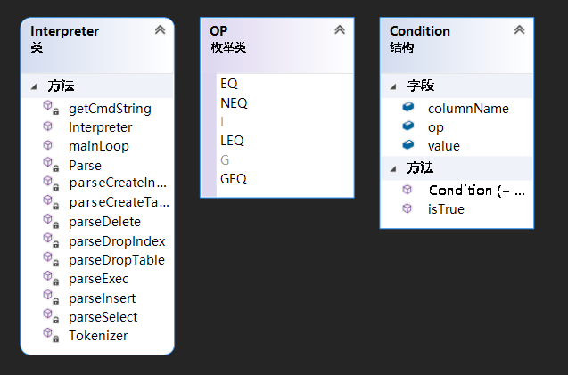

## Interpreter

### 功能概述

Interpreter模块直接与用户交互，主要实现以下功能：

1. 程序流程控制，即“启动并初始化 $\rarr$ ‘接收命令、处理命令、显示命令结果’循环 $\rarr$ 退出”流程

2. 接收并解释用户输入的命令，生成命令的内部数据结构表示，同时检查命令的语法正确性和语义正确性，对正确的命令调用API层提供的函数执行并显示执行结果，对不正确的命令显示错误信息

### 数据结构

Interpreter 定义了枚举类 OP，用来统一表示条件语句中的符号类型：

```cpp
enum class OP
{
    EQ,
    NEQ,
    L,
    LEQ,
    G,
    GEQ
};
```

符号的表示参考了 LaTeX 的语法规则。

Interpreter 定义了结构体 Condition 来存储 `insert` 和 `delete` 操作中的条件语句：

```cpp
struct Condition
{
    std::string columnName;
    OP op;
    Value value;
    Condition(){};
    Condition(std::string &, OP, const Value &);
    bool isTrue(const Value&) const;
};
```

Interpreter 内部还使用到了一个字符串数组，用于存储分词后的一整条 SQL 语句，便于进行语法分析。

### 接口定义

Interpreter 类开放的接口仅有 mainLoop，无须任何参数，作为供 MiniSQL 的 main 函数调用进行读入语句并操作的循环，也是 main 函数中唯一的函数，一切操作由此开始。

### 类图



### 设计思路

Interpreter 开放一个 mainLoop 函数供 MiniSQL 的 main 函数调用进行读入语句并操作的循环。mainLoop 内部需要完成将分行的一条 SQL 语句合并为一个字符串，再将字符串进行分词，用 vector 来存储字符串中的每一个词以便进行后续的判断。分词之后通过判别关键词进行语法分析，再去调用 API 的接口完成操作。

### 关键函数

getCmdString 函数处理一条语句的多分行输入的情况，并将符号与富含意义的词区分开：

```cpp
std::string Interpreter::getCmdString()
{
    std::string cmd;
    std::cout << "MiniSQL> ";
    while (true)
    {
        std::string line;
        std::getline(std::cin, line);

        for (int i = 0; i < line.length(); i++) 
        {
            if (line[i] == '*' || line[i] == '=' || line[i] == ',' || line[i] == '(' || line[i] == ')' || line[i] == '<' || line[i] == '>' || line[i] == ';') 
                {
                    if (line[i-1] != ' ') line.insert(i++, " ");
                    if (line[i+1] != ' ') line.insert(++i, " ");
                }
        }

        cmd += line;

        while (!line.empty() && isspace(line.back()))  
            line.pop_back();
        if (line.back() == ';') return cmd;
        cmd.push_back(' ');
        std::cout << "      —> ";
    }
}
```

Tokenizer 函数将读入的一条 SQL 语句进行分词，以 vector 的形式存储，更便于各种关键词的判断：

```cpp
std::vector<std::string> Interpreter::Tokenizer(const std::string &str)
{
    std::vector<std::string> res;
	if("" == str) return res;
	//先将要切割的字符串从string类型转换为char*类型
	char * strs = new char[str.length() + 1];
	strcpy(strs, str.c_str()); 
 
	char *p = strtok(strs, " ");
	while(p) 
    {
		std::string s = p; //分割得到的字符串转换为string类型
		res.push_back(s); //存入结果数组
		p = strtok(NULL, " ");
	}
 
	return res;
}
```

Parse 函数进行初步的语法分析和异常处理工作：

```cpp
void Interpreter::Parse(const std::vector<std::string> &strvec)
{
    if (strvec.at(0) == "create")
    {
        if (strvec.at(1) == "table") parseCreateTable(strvec);
        else if (strvec.at(1) == "index") parseCreateIndex(strvec);
        else std::cout << "ERROR : You have an error in your SQL syntax; check the manual that corresponds to your MiniSQL server version for the right syntax to use near '" << strvec.at(1) << "'\n";
    }
    else if (strvec.at(0) == "drop")
    {
        if (strvec.at(1) == "table") parseDropTable(strvec);
        else if (strvec.at(1) == "index") parseDropIndex(strvec);
        else std::cout << "ERROR : You have an error in your SQL syntax; check the manual that corresponds to your MiniSQL server version for the right syntax to use near '" << strvec.at(1) << "'\n";
    }
    else if (strvec.at(0) == "insert") parseInsert(strvec);
    else if (strvec.at(0) == "delete") parseDelete(strvec);
    else if (strvec.at(0) == "select") parseSelect(strvec);
    else if (strvec.at(0) == "execfile") parseExec(strvec);
    else if (strvec.at(0) == "quit" || strvec.at(0) == "exit")
    {
        std::cout << "Bye\n";
        API::endLoop();
    }
    else
    {
        std::cerr << "ERROR : You have an error in your SQL syntax; check the manual that corresponds to your MiniSQL server version for the right syntax to use near '" << strvec.at(0) << "'.\n";
}
```

进一步的语法分析工作由以下函数完成，工作原理大同小异，根据不同类型 SQL 语句的特征提取关键词，例如表明、属性名、索引名等，并调用 API 提供的接口：

```cpp
void parseCreateTable(const std::vector<std::string> &strvec);
void parseCreateIndex(const std::vector<std::string> &strvec);
void parseDropTable(const std::vector<std::string> &strvec);
void parseDropIndex(const std::vector<std::string> &strvec);
void parseInsert(const std::vector<std::string> &strvec);
void parseDelete(const std::vector<std::string> &strvec);
void parseSelect(const std::vector<std::string> &strvec);
void parseExec(const std::vector<std::string> &strvec);
```

这里仅详细展示 parseCreateTable 函数的细节，其余函数不再展开：

```cpp
void Interpreter::parseCreateTable(const std::vector<std::string> &strvec)
{
    std::string tableName = strvec.at(2);
    std::vector<Column> Columns;
    std::string primaryKey;
    bool hasPrimaryKey = false;
    int vecSize = strvec.size();

    try
    {
        if (strvec.at(vecSize-7) == "primary" && strvec.at(vecSize-6) == "key")
        {
            primaryKey = strvec.at(vecSize-4);
        }
        else
        {
            std::cerr << "ERROR : You have an error in your SQL syntax; the primary key must be set when create table.\n";
            //throw("ERROR : You have an error in your SQL syntax; the primary key must be set when create table.\n");
        }
        
        for (int i = 4; i < vecSize - 7; )
        {
            Column column;
            column.columnName = strvec.at(i++);

            if (column.columnName == primaryKey)
            {
                hasPrimaryKey = true;
                column.isPrimaryKey = true;
                column.isUnique = true;
            }

            if (strvec.at(i) == "int")
            {
                column.field = Field::INT;
                i++;
            }
            else if (strvec.at(i) == "float")
            {
                column.field = Field::FLOAT;
                i++;
            }
            else if (strvec.at(i) == "char")
            {
                column.field = Field::CHAR;
                i += 2;
                column.charSize = std::stoi(strvec.at(i));
                i += 2;
            }
            else
            {
                std::cerr << "ERROR : You have an error in your SQL syntax; the type "<<strvec.at(i)<<" is not defined.\n";
                return ;
            }

            if (strvec.at(i) == "unique")
            {
                column.isUnique = true;
                i++;
            }
            i++;
            Columns.push_back(column);
        }

        if (!hasPrimaryKey)
        {
            std::cerr << "ERROR : You have an error in your SQL syntax; the primary key must be set when create table.\n";
        }

        auto start = std::chrono::high_resolution_clock::now();
        API::createTable(tableName, Columns, primaryKey);
        auto end = std::chrono::high_resolution_clock::now();
        auto duration = std::chrono::duration_cast<std::chrono::microseconds>(end - start);
        std::cout << "Command was successfully executed and took " << double(duration.count()) * std::chrono::microseconds::period::num / std::chrono::microseconds::period::den << "s.\n";
    }
    catch (std::exception &error)
    {
        std::cerr << error.what() << std::endl;
    }
}
```

