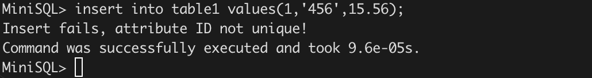
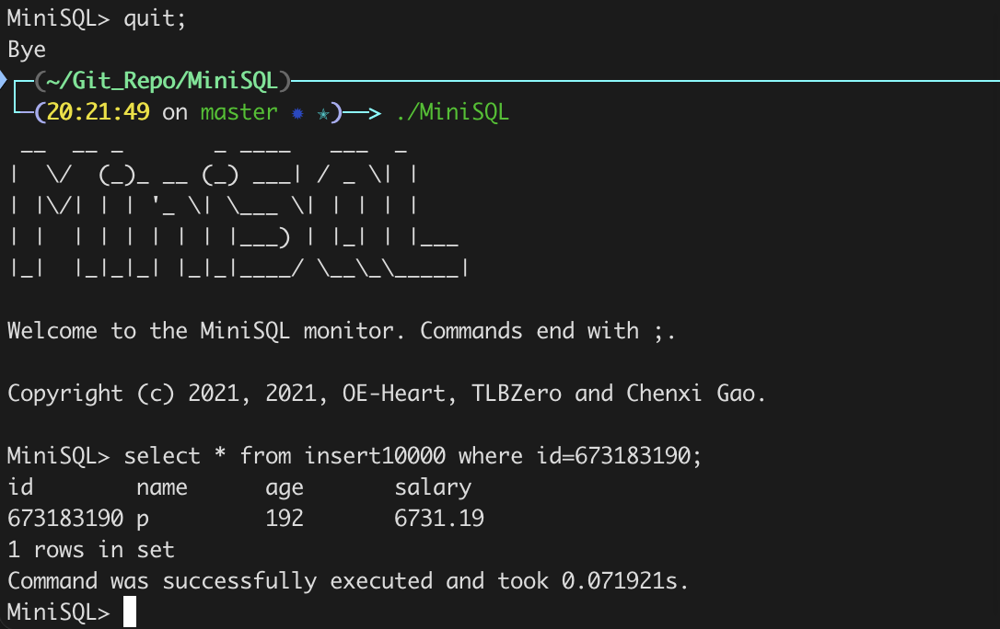

```sql
//创建表语句
create table table1 (
  ID int,
  name char(50),
  assets float,
  primary key(ID)
);
```


---

```sql
//重复创建表，报错
create table table1 (
  ID int,
  name char(50),
  assets float,
  primary key(ID)
);
```


---

```sql
//插入数据
insert into table1 values(1,'123',15.56);
insert into table1 values(2,'123',15.56);
insert into table1 values(3,'abc',15.56);
insert into table1 values(4,'abc',20);
insert into table1 values(5,'def',15.56);
insert into table1 values(6,'def',20);
```


----

```sql
//测试对主键插入重复数据，报错
insert into table1 values(1,'456',15.56);
```



---

```sql
//查询主键数据，只获得一条
select * from table1 where ID=1;
```


---

```sql
//删除记录
select * from table1;
delete from table1 where ID<=2;
select * from table1;
```


---
```sql
//查询非主键数据，返回多条记录
select * from table1 where assets=15.56;
```


---
```sql
//测试范围查询
select * from table1 where ID<3;
```


```sql
select * from table1 where ID>3;
```


```sql
select * from table1 where ID<>4;
```


---

```sql
//创建索引
create index iname on table1(ID);

//测试建立索引名重复的索引，报错
create index iname on table1(ID);
```


---

```sql
//删除索引
drop index iname;

//删除表语句
drop table table1;
```


---


```sql
//测试从文件读入指令，压力测试
//建立一张新表，插入10000条数据，进行select操作，进行有无index的运行速度比较
execfile insert10000.sql;
```


```sql
select * from insert10000 where id=673183190;
	//记录时间
```


```sql
drop index insert10000_Primary;	//删除创建表时自动在主键上创建的index
select * from insert10000 where id=673183190;
	//记录时间
```


```sql
//退出，测试文件保存
quit;

//再次打开，直接对insert10000进行select，正确
select * from insert10000 where id=673183190;
```




